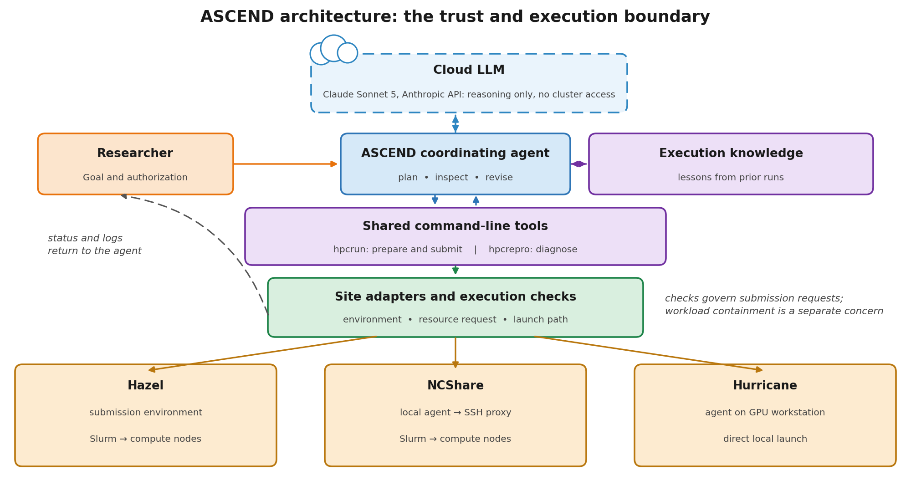
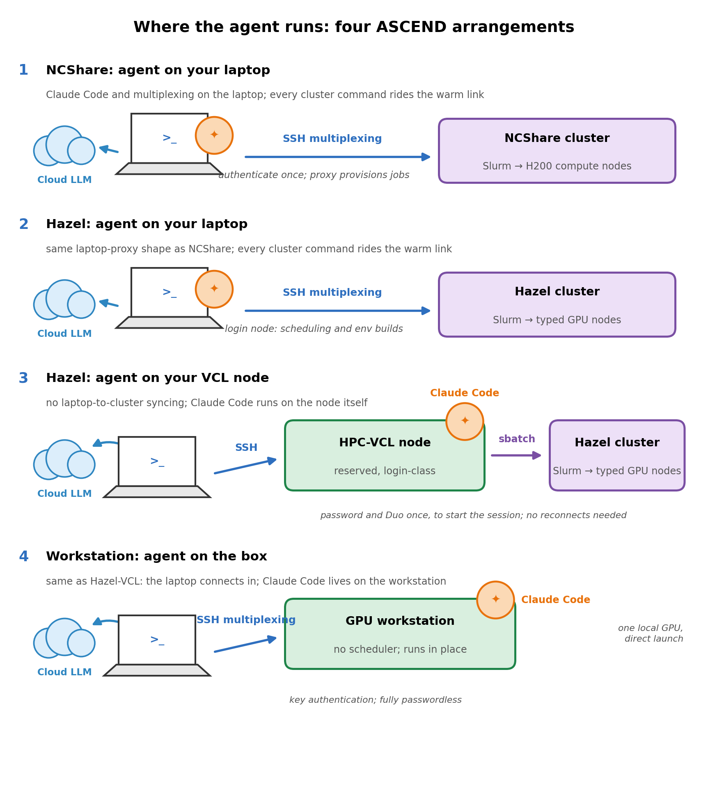
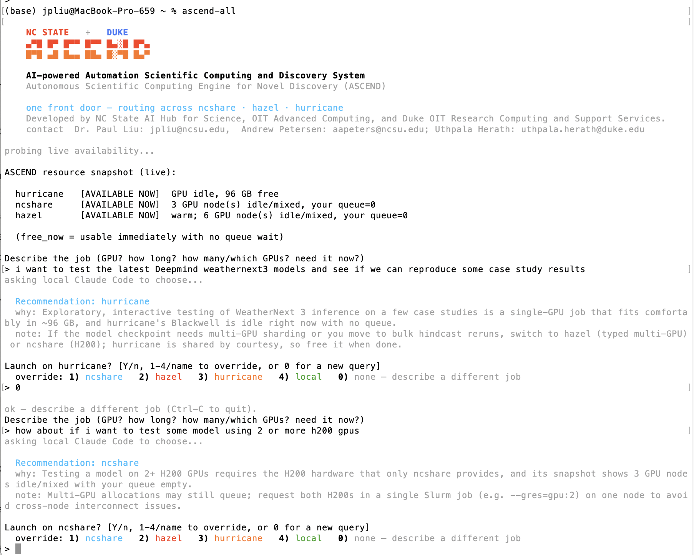
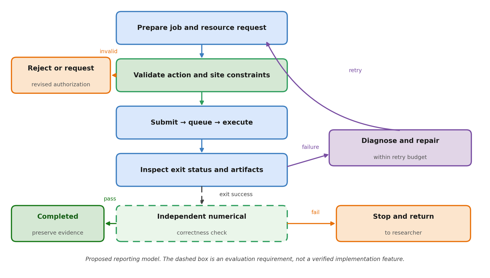

# ASCEND

**Autonomous Scientific Computing Engine for Novel Discovery**

Personal AI agents for autonomous scientific computing across HPC clusters and GPU workstations.

*Developed by the NC State AI Hub for Science and the OIT Advanced Computing team, with Duke OIT Research Computing and Support Services (NCShare arrangement).*
Contact: Dr. Paul Liu (<jpliu@ncsu.edu>), Andrew Petersen (<aapeters@ncsu.edu>), Dr. Uthpala Herath (<uthpala.herath@duke.edu>)

---

## What this is

ASCEND turns a laptop into the control point for scientific computing on shared clusters. Claude Code runs **on your own machine**. Every cluster command travels over a multiplexed SSH connection that you authenticate once per work session, after which the agent submits jobs, reads logs, diagnoses failures, repairs code, and resubmits without prompting you for a password again.

Nothing runs on the cluster except your jobs. There is no agent daemon on a login node, no service to request from your site administrators, and no credential held by anything other than your own SSH client.

The system has been used to reproduce a published machine-learning weather model, to find and fix two undefined-behaviour bugs in a released geophysical flow solver, and to port that solver from serial to OpenMP, which cut a production avalanche simulation from about twelve hours to roughly ninety minutes.



The agent reasons through a cloud language model that never has cluster access. A shared command-line layer (`hpcrun` to prepare and submit, `hpcrepro` to diagnose) sits between the agent and site adapters that know each resource's environment, resource-request syntax, and launch path.

---

> [!IMPORTANT]
> **Before you go any further, you need an account you can already reach over SSH.**
>
> ASCEND installs onto a resource you have access to. It does not obtain access for you, and the installer will stop if it cannot log in. Confirm at least one of these works from your own terminal, right now:
>
> ```bash
> ssh <your-ncshare-username>@login.ncshare.org     # NCShare
> ssh <your-unity-id>@login.hpc.ncsu.edu            # NCSU Hazel
> ssh <your-username>@<your-workstation>            # a GPU workstation such as hurricane
> ```
>
> If none of those gets you a shell, stop here and request an account first. NCShare accounts come through [userguide.ncshare.org](https://userguide.ncshare.org/guides/); Hazel accounts require a Unity ID and membership in an HPC project, see [hpc.ncsu.edu](https://hpc.ncsu.edu/main.php); a workstation account comes from whoever administers that machine.
>
> You will also need Claude Code with a Claude subscription on your laptop. The installer offers to fetch it if it is missing.

---

## Quick start

```bash
git clone https://github.com/jpliu168/ASCEND.git
cd ASCEND
./install.sh
```

The installer asks which resources you want and loops until you say you are done. Re-run it any time to add another. **Keep the clone** after installing: the commands it puts in `~/.local/bin` are symlinks into this directory, so a later `git pull` updates every installed command in place.

To install exactly one arrangement without the menu:

```bash
./install.sh hazel        # NCSU Hazel only
./install.sh ncshare      # NCShare only
./install.sh hurricane    # MEAS single-GPU box only
./install.sh router       # just the ascend-all front door
./install.sh all          # the interactive menu (default)
```

If you only want one site and would rather not download the rest, use a sparse checkout:

```bash
git clone --filter=blob:none --sparse https://github.com/jpliu168/ASCEND.git
cd ASCEND
git sparse-checkout set common hazel docs
./install.sh hazel
```

Verify from a **new** terminal:

```bash
ascend-hazel --check        # socket probe, login node, Slurm, tools
ascend-ncshare --check      # both proxy aliases end to end
ascend-hurricane --check    # box, GPU, claude, tmux
ascend-all                  # the router: probe and recommendation
```

---

## The four arrangements



| Package | Resource | Where the agent runs | How work reaches compute |
|---|---|---|---|
| `ascend-hazel` | NCSU Hazel HPC | your laptop | multiplexed SSH to `login.hpc.ncsu.edu`; login node used only for scheduling and environment builds, all compute inside Slurm with typed GPU requests such as `--gres=gpu:l40s:1` |
| `ascend-ncshare` | NCShare (Duke/NC State) | your laptop | the `ncshare-agent` and `ncshare-agent-gpu` proxy aliases, which provision or reuse a Slurm job per command |
| `ascend-hurricane` | MEAS single-GPU box (RTX PRO 6000 Blackwell, about 98 GB) | your laptop | direct SSH; no scheduler, so work runs in place, one heavy job at a time |
| `ascend-all` | all of the above | your laptop | describes the job to the model, probes live capacity, recommends a resource, then launches that launcher |

Because the agent lives on the laptop, keep the laptop awake and connected while the agent is actively working. Jobs already submitted to Slurm keep running with the lid closed; reopen, re-warm the link, and `claude --resume` to pick up where you left off.

---

## The front door

`ascend-all` is one command for all three resources. It probes what is actually free right now, asks the model which resource fits the job you described, explains the reasoning, and dispatches only after you confirm. Answering `0` discards the recommendation and lets you describe a different job against the same snapshot.



---

## How failures are handled



A job is prepared, validated against site rules and the resource request, submitted, and then judged twice: once on whether it ran, and separately on whether the result is scientifically correct. Recoverable failures are diagnosed and retried within an explicit retry budget. Exhausted retries, or any change that would go beyond what you authorized, return control to you rather than being worked around.

---

## Prerequisites

You need an account on at least one resource before installing:

* **Hazel** a Unity ID in an HPC project, such that `ssh <unityID>@login.hpc.ncsu.edu` works
* **NCShare** an NCShare username with a `/work/<user>` directory
* **hurricane** an account on the box (NC State MEAS)

You also need macOS, Linux, or Windows with WSL (Ubuntu), plus `bash`, `ssh`, `rsync`, and `git`. On Windows, do everything inside the Ubuntu shell and keep the clone in the Linux home directory, not under `/mnt/c`.

Claude Code with a Claude subscription must be installed on the laptop. The installer offers to fetch it (`curl -fsSL https://claude.ai/install.sh | bash`); run `claude` once afterwards to log in.

If `~/.local/bin` is not already on your `PATH`, add it:

```bash
export PATH="$HOME/.local/bin:$PATH"
```

---

## SSH multiplexing

Multiplexing is what makes the laptop-driven arrangement practical. You authenticate once, interactively, including two-factor where the site requires it, and a control socket stays open for the rest of the session. Every later command the agent sends reuses that socket with no prompt. Without it, each command would need a fresh two-factor confirmation, which is incompatible with an automated control loop.

The installer writes these aliases for you if they are missing. For reference:

```sshconfig
# Hazel: password plus Duo, once per 8 hours
Host hazel
  HostName login.hpc.ncsu.edu
  User <unityID>
  ControlMaster auto
  ControlPath ~/.ssh/cm-%r@%h-%p
  ControlPersist 8h
  ServerAliveInterval 30
  ServerAliveCountMax 4

# hurricane: key authentication, no Duo (run ssh-copy-id hurricane once)
Host hurricane
  HostName hurricane.meas.ncsu.edu
  User <unityID>
  ControlMaster auto
  ControlPath ~/.ssh/sockets/%r@%h-%p
  ControlPersist 8h
  ServerAliveInterval 30
  ServerAliveCountMax 4
```

NCShare uses the `ncshare-agent` and `ncshare-agent-gpu` blocks published at [userguide.ncshare.org/guides/ai](https://userguide.ncshare.org/guides/ai); the installer writes them verbatim with your username. They need `~/.ssh/sockets` to exist, with mode 700.

Warm a link by hand with `ssh hazel`, check one with `ascend-hazel --check`, and drop one with `ssh -O exit hazel`.

---

## Daily use

```bash
ssh hazel                    # warm the link once per session (Duo)
ascend-all                   # or go straight to a specific launcher
cd <project> && ascend-hazel
```

The first start in a project directory seeds an `AGENTS.md`: the agent's standing instructions for that resource, personalized with your username. It covers the execution policy, storage and Conda rules, and when the agent should suggest moving the work to a different resource.

The rules each agent enforces per site:

**Hazel.** The login node is for scheduling and environment builds only, never computation. Typed GPU requests are mandatory. Conda environments must be created with `--prefix` under `/share/<user>`, never a bare `-n`, because `/home` is limited to 15 GB and ten thousand files. `/share` is purged after thirty days idle.

**NCShare.** The first command after an idle period can take about a minute while Slurm provisions the job. Wait it out rather than interrupting. `/work/<user>` is purged after seventy-five days.

**hurricane.** The single GPU is shared by courtesy, so check `nvidia-smi` first and run one heavy job at a time. Long runs belong in `tmux`. Blackwell needs CUDA 12.8 or newer and `cu128` wheels.

---

## Repository layout

```
install.sh                 top-level installer and dispatcher
setup.sh                   the interactive multi-resource setup
common/ascend/             shared harness deployed to each resource (hpcrun, hpcrepro, skills)
common/ascend-all/         the ascend-all router and ascend-probe
common/mac/bin/            laptop-side paper retrieval helpers
hazel/                     Hazel setup, deploy, launcher, and the hpc-slurm skill
ncshare/                   NCShare setup, deploy, launcher, and skills
hurricane/                 hurricane setup, deploy, launcher, and the gpu-local skill
docs/                      standalone install guides and figures
tools/                     scripts that build the distributable zips
```

---

## Testing

If you were asked to trial this before release, follow
[docs/TESTING.md](docs/TESTING.md) and report what happened. It walks through
getting the code, installing, verifying from a fresh terminal, seeding a
project, giving the agent a real job, and the routing front door, and it says
what is worth reporting at each step.

---

## Standalone install guides

Long-form guides, suitable for handing to someone who is not reading this file:

* [docs/INSTALL-ascend-all.txt](docs/INSTALL-ascend-all.txt) all three resources plus the router
* [docs/INSTALL-ascend-hazel.txt](docs/INSTALL-ascend-hazel.txt) Hazel on its own

Site documentation: [NCShare user guide](https://userguide.ncshare.org/guides/) and [NC State HPC (Hazel)](https://hpc.ncsu.edu/main.php).

---

## Troubleshooting

**`command not found` after installing.** Open a new terminal, or `source ~/.bashrc`, or add `~/.local/bin` to `PATH`.

**Hazel link reported COLD.** Run `ssh hazel` once to authenticate, then re-check. `--check` deliberately probes the local socket rather than opening a connection, so it never triggers a Duo prompt on its own.

**NCShare exits 255 with no message.** The socket directory is missing: `mkdir -p ~/.ssh/sockets && chmod 700 ~/.ssh/sockets`.

**NCShare seems to hang on the first connect.** It is provisioning a Slurm job, which can take up to about four minutes. Wait rather than pressing Ctrl-C.

**hurricane does not resolve.** Its DNS is campus-internal and its address is private. On campus it usually just works; if your laptop uses an external resolver, pin the address in `/etc/hosts`. Off campus it needs a jump host through a warm Hazel link.

**Permissions lost after copying through Windows.** `sudo chown -R $USER:$USER . && chmod -R u+x .` The setup scripts also repair execute bits on startup.

---

## Citing this work

If ASCEND supports work you publish, please cite the accompanying paper (in preparation) and this repository:

> Liu, J. P., Petersen, A., and Herath, U. *ASCEND: Personal AI Agents for Autonomous Scientific Computing Across HPC Clusters and GPU Workstations.* https://github.com/jpliu168/ASCEND

---

## License

MIT. See [LICENSE](LICENSE).
