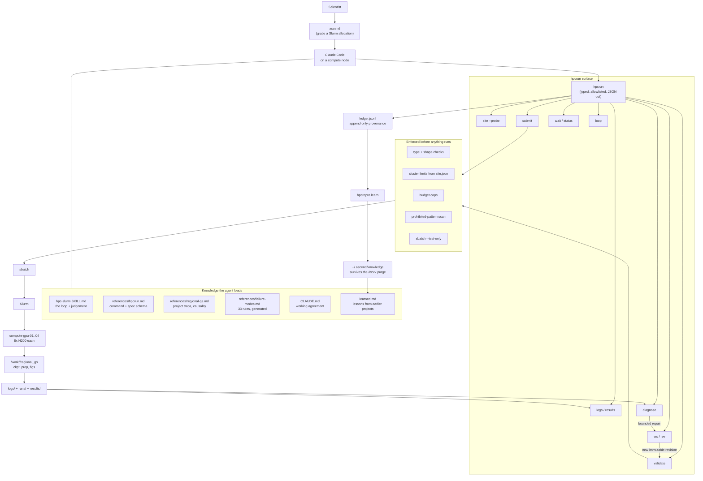
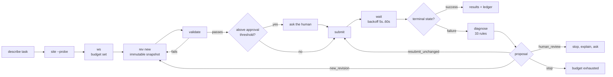

# ASCEND — Architecture and As-Built Report

**ASCEND** — Autonomous Scientific Computing Engine for Novel Discovery
*an AI-powered automation system for scientific computing and discovery*

**Status:** implemented and verified on NCShare, August 2026
**Author:** J. Paul Liu (NC State MEAS), with Claude
**Scope:** `ascend` launcher + `hpcrun` harness + `hpcrepro` reproduction and learning layer + `hpc-slurm` and `repro` skills, on Claude Code
**Note on naming:** ASCEND is the system; Claude Code is the agent runtime it is built on. Claude Code's startup banner cannot be replaced — there is no setting for it, only an open feature request — so `ascend` prints above it and the status line carries the name for the rest of the session.
**Pilot workload:** `regional_gs` — Gulf Stream SST forecasting (GraphCast GNN + EDM diffusion)

---

## 1. Purpose

This document describes a framework that lets an AI agent take a scientific
computing task from description to result on an institutional HPC system:
generate and validate code, submit scheduler jobs, monitor them, retrieve logs
and results, diagnose failures, propose bounded corrections, and resubmit —
within limits it cannot raise on its own.

The original version of this document was a *proposal*. This version is an
*as-built report*. Where the proposal turned out to be wrong, the wrong version
is retained and marked, because those corrections are the most transferable
part of the work.

### What changed from the proposal

| Proposed | Built | Why |
|---|---|---|
| MCP server + remote agent | Agent runs **on the cluster**; a CLI harness replaces the MCP layer | No inbound network path to the login node; running the agent locally removes the need for a gateway service entirely |
| Login node as thin control plane | Login node used **only for `ssh`** | Claude Code does not start on it (§8.1) |
| Agent calls typed MCP tools | Agent calls `hpcrun` subcommands returning JSON | Same contract — typed, allowlisted, auditable — without a network service to secure and operate |
| Skills describe how to run software | Skill also encodes **judgement**: when to stop, when to ask, what not to auto-fix | Capability without restraint is the failure mode that costs allocation |

The core separation the proposal argued for held up: **the agent reasons; a
controlled layer acts.** Only the transport changed.

---

## 2. As-built architecture



### Layer responsibilities

| Layer | Owns | Explicitly does not own |
|---|---|---|
| Claude Code | Planning, code, hypotheses, diagnosis of novel failures | Direct scheduler or filesystem writes |
| Skill + references | Domain knowledge, cluster facts, judgement rules | Execution |
| `hpcrun` | Typed operations, validation, budgets, provenance | Deciding what science to run |
| Slurm | Queuing, allocation, accounting, enforcement | Anything about correctness |
| `/work` + `/data` | Code snapshots, logs, results, checkpoints | Durability (`/work` is purged — §7.3) |

---

## 3. The operating loop



Every subcommand emits one JSON object on stdout, so the agent parses
structured results rather than screen-scraping human-formatted text.

### Step detail

1. **`site --probe`** — reads real partitions, walltime caps, cpus/node,
   mem/node, gres, node states, and Slurm associations into `site.json`.
   Everything downstream validates against this rather than against
   assumptions. *This is the step that made most of §8 discoverable.*
2. **`ws`** — creates a workspace and fixes its budget: attempts, node-hours,
   GPU-hours, concurrency, approval threshold.
3. **`rev new`** — snapshots code into `rev-NNNN/code/`, SHA-256s every file,
   writes `spec.json`, marks it read-only. Built in a staging directory and
   renamed into place so a partial failure cannot leave a half-built revision.
4. **`validate`** — nine checks (§5). Refuses rather than warns where the
   scheduler would reject or silently misbehave.
5. **`submit`** — renders the `#SBATCH` script from a template, charges the
   estimate to the budget, records `submit.json`.
6. **`wait`** — exponential backoff to a terminal state. Never busy-polls.
7. **`logs` / `results`** — returns log text explicitly labelled as untrusted
   data, and staged artifacts with hashes.
8. **`diagnose`** — matches 33 ranked rules against stdout+stderr and the
   scheduler state, and emits one of four proposals.
9. **`loop`** — runs the whole cycle unattended within the budget.

---

## 4. Job specs, not shell strings

The agent never writes `#SBATCH` lines and never composes a shell command.
It writes a structured spec; the harness renders the script.

```json
{
  "name": "gs_full",
  "partition": "gpu-hp",
  "qos": "ncsu_h200_hp",
  "nodes": 1, "tasks_per_node": 1, "cpus_per_task": 64,
  "gpus_per_node": 8, "gpu_type": "h200",
  "mem_per_node_gb": 480,
  "walltime_minutes": 720,
  "workdir": "/work/<user>/regional_gs",
  "environment": {
    "conda_env": "/work/<user>/regional_gs/env",
    "conda_sh": "/hpc/home/<user>/miniforge3/etc/profile.d/conda.sh",
    "vars": {"GS_ROOT": "...", "E_R2": "150", "NPROC": "8"}
  },
  "entrypoint": ["bash", "{CODEDIR}/pipeline.sh"],
  "retry_policy": {"maximum_attempts": 3}
}
```

Three design points worth stating.

**`entrypoint` is argv, not a command line.** Multi-step work goes into a
script inside the revision. `{CODEDIR}` and friends are expanded in Python at
render time, never by a shell.

**`workdir` decides sandbox versus project mode**, and getting it wrong fails
*silently* — see §8.3.

**Run knobs live in `environment.vars`**, so each run's configuration is
captured in the immutable revision rather than in a script someone edited.

---

## 5. What validation actually enforces

| # | Check | Failure mode it prevents |
|---|---|---|
| 0 | Numeric fields type-checked before arithmetic | Traceback instead of a structured error |
| 1 | Directive fields match `^[A-Za-z0-9._:+-]{1,64}$` | **Shell injection** (§8.2) |
| 2 | `entrypoint` is a non-empty list of strings | Shell-string execution |
| 3 | Partition, account, QOS exist in `site.json` | Job rejected at submit |
| 4 | Walltime ≤ partition cap; tasks×cpus ≤ cpus/node | Pends forever |
| 5 | **Memory ≤ actual node RAM** | Pends forever with a misleading reason (§8.4) |
| 6 | Budget: attempts, node-hours, GPU-hours | Runaway spend |
| 7 | Prohibited-pattern scan over code **and spec** | Destructive or exfiltrating commands |
| 8 | Output globs contain no shell metacharacters | Command substitution in staging |
| 9 | `sbatch --test-only` | Anything Slurm itself objects to |

---

## 6. Failure diagnosis and bounded repair

33 rules, ranked most-specific-first, in three families:

- **Generic HPC:** OOM, walltime, node failure, preemption, MPI abort, quota,
  permissions, missing inputs, segfault, NaN divergence.
- **NCShare/site:** no module system, conda activation failure, wrong
  interpreter, torchrun rendezvous port, gres type missing, cgroup/CPU
  baseline.
- **Project-specific:** numpy≥2 ABI break, corrupt dist-info, checkpoint shape
  mismatch, stale rollout-mean cache, CMEMS/CDS credential expiry.

**Only three failure classes are auto-repairable:** memory, walltime, and
transient node failure. Everything else halts for human review.

This asymmetry is deliberate and is the central safety argument. A
`MemoryError` has exactly one mechanical fix. A `RuntimeError` in a training
loop has many possible causes, and doubling the memory addresses none of them —
it just spends allocation to reach the same failure. Repairs escalate
(roughly double) rather than jumping to the maximum.

---

## 7. Safety model

### 7.1 Budgets an agent cannot raise

Caps live in `workspace.json`. Submissions past a cap are refused. The skill
instructs the agent to stop and report rather than edit the file — *a cap an
agent can lift is not a cap.* Runs above the approval threshold require
`--approve`, which means a human said yes.

**Verified:** one human `--approve` originally authorized every
machine-generated revision that followed. Now it is consumed by the first
attempt only; anything the loop generates afterwards must clear the gate on
its own.

### 7.2 Untrusted inputs

Job logs, input files, dataset names, and third-party error text are **data**.
`hpcrun logs` labels them as such and the skill instructs the agent that
instruction-shaped text inside a log is a string in a file, not a message to
it. Logs are the natural prompt-injection surface in this design: they are
attacker-influenceable in principle and are fed directly to a model.

### 7.3 Durability — `/work` is purged after 75 days

The pilot project's conda env, prepared inputs, 11.8 GB rollout-mean cache,
and **every checkpoint** live on `/work`. Measured at time of writing: oldest
checkpoint 53 days, 22 days of headroom, 272 MB total.

The prepared inputs are rebuildable at the cost of days of CMEMS/CDS
downloads. The trained checkpoints are not — re-running the curriculum costs
real GPU-hours and will not reproduce bit-for-bit. Irreplaceable artifacts
belong on `/data/<user>`, a separate export that is not purged.

A conda env should be preserved as `conda list --explicit`, not as a directory
copy: envs embed absolute paths in console-script shebangs.

### 7.4 Provenance

Every action appends to `ledger.jsonl`. Every submission is bound to an
immutable, hash-verified revision. The rendered script and logs live *outside*
the revision so it genuinely does not change after creation.

---

## 8. What we got wrong, and what it cost

The most useful section. Each item was believed correct until real output
contradicted it.

### 8.1 Claude Code does not start on the NCShare login node

Reproduced repeatedly: the binary loads (`claude --version` returns instantly),
then it makes **zero network syscalls** and parks on
`futex(FUTEX_WAIT_PRIVATE, 30s)` until killed. 622 syscalls in 30 seconds — it
is not busy, not blocked on I/O, not waiting on the network.

Eliminated by direct test: network reachability (`curl` to the API returns
200), auth, proxy settings, `~/.claude` config, installed skills, working
directory size, stdin, `TERM`, disk quota, `ulimit`, and leftover processes.
Reproduces with a pristine `HOME` and an empty working directory. **Works
correctly on a compute node.**

Workaround: `claude-node` grabs a small allocation and runs Claude there;
`sbatch` works from inside an allocation, so the harness is unaffected.

Root cause **not established**. Both login and compute nodes are cgroup v1,
which killed the obvious hypothesis. The remaining untested lead is `nproc`
reporting a large core count on a busy shared login node versus 2 inside an
allocation, which could mis-size a thread pool.

*Consequence for the design:* the agent runs inside an allocation, so `srun`
is unavailable to it. The skill and working agreement say so explicitly.

### 8.2 The first harness was injectable

An adversarial review of the first implementation found working exploits:

- **Newline injection through `qos` / `account` / `partition`.** These were
  interpolated into `#SBATCH` lines unescaped. A newline ended the comment
  block and everything after it executed as shell — *and* silently dropped
  every later directive, including `--export=NONE`.
- Same through `extra_directives`.
- **Command substitution in an `outputs` glob** and in the workspace path.
- **`sudo` / `curl | sh` placed in `entrypoint`** — the prohibited-pattern
  scan covered only `code/`, missing the actual execution vector.
- **Padding a file past 2 MB** skipped the scan entirely.
- Path traversal through `--job`; `--project ..` escaping the workspace root.

*Lesson:* a safety scan that inspects the wrong surface provides confidence
without protection. The spec itself is executable content and must be
validated as such.

### 8.3 Sandbox versus project mode fails silently

The harness originally copied a revision's code into a per-job sandbox. For
`regional_gs` that is silently catastrophic: every training stage resumes from
`ckpt/<name>_last.pt`, which does not exist in a sandbox. The run would
cold-start, log a perfectly healthy epoch 1, and consume the full allocation
producing nothing.

Any job that must see state outliving itself needs project mode.

### 8.4 `--mem=512G` was never schedulable

The hand-written batch scripts requested `--mem=512G`. The GPU nodes have
515000 MB ≈ 503 GB. 512 G asks for 524288 MB — about 9 GB more than exists.
Slurm does not say "too much memory"; it pends with *"Requested node
configuration is not available"*, which reads like a GPU problem.

### 8.5 A successful job was reported as failed

`squeue` carries no exit code, and Slurm keeps finished jobs listed for
`MinJobAge` (default 300 s) — exactly the window `wait` returns in. The
harness took `squeue`'s terminal answer, found `exit_code = None`, and
concluded failure. Every successful run would have been misreported.

### 8.6 Smaller corrections that cost real time

| Belief | Reality |
|---|---|
| `--gres=gpu:N` | NCShare needs `gpu:h200:N` |
| `command -v conda` detects conda | conda is a **shell function**; a batch job must source `conda.sh` by absolute path |
| Modules available | **No module system at all** — conda only |
| `--export=NONE` is good hygiene | It breaks conda discovery; the working scripts don't use it |
| Account `ncsu_meas` | Account is `ncsu`; no `--account` needed |
| `gpu-hp` capped near 24 h | 30 days |
| `sinfo` output is safe to parse | Default column widths **truncate**; a clipped walltime silently disables the cap check |
| `mix-` means draining | It is a truncated state name |

*Pattern:* every one of these was corrected by real command output, not by
reasoning. The `site --probe` step exists so the system re-derives them each
session rather than trusting this table.

### 8.7 A resubmit-safety bug in the original pipeline

`run_full_pipeline.sbatch` begins with `rm -f $CK/gnn_stage1*.pt` and passes
`--fresh` to every stage. With a 24 h walltime, a job that times out and is
resubmitted **destroys all progress and restarts** — and can never finish if
the pipeline needs more than one walltime. The harness version resumes by
default; a fresh start is opt-in and takes a timestamped backup first.

### 8.8 The permission config asked about everything

The first permission config shipped `defaultMode: "acceptEdits"` and put
`pip`, `conda`, `uv`, `curl`, `wget`, `git clone`, `mv` and `chmod` on the
`ask` list, reasoning that those were the operations that had cost the project
time before. In practice the agent was interrupted every few seconds and the
harness was unusable — the opposite of the intent.

Two mechanisms, both documented, produced that:

1. **An `ask` rule beats an `allow` rule**, at every scope and across every
   settings file. A rule on both lists is effectively only on `ask`, so the
   allow entries next to them were dead weight. This is also why a stale rule
   left over from an earlier version silently cancels a new allow — the most
   likely answer to "why is it still prompting?"
2. **`acceptEdits` auto-approves file edits but still prompts for every shell
   command.** It was the wrong mode for a workload that is almost entirely
   shell.

The fix was `defaultMode: "auto"` — no prompting, with a background classifier
reviewing calls — and an `ask` list cut to `rm`, `rmdir`, and the destructive
git commands. Crucially, `auto` **keeps `deny` in force**, so raw `sbatch`,
`scancel`, `srun`, `sudo` and credential-file reads remain blocked and the
harness still cannot be bypassed. `bypassPermissions` and
`--dangerously-skip-permissions` would have been the obvious "just stop
asking" answer and are the wrong one here: they drop the deny list too, which
is the part actually doing the work.

The honest cost of the change: nothing now mechanically prevents a stray
`pip install` from upgrading numpy and breaking torch's ABI in the
`regional_gs` environment. That guard is now a documented rule in `CLAUDE.md`
rather than an enforced one — a deliberate trade of one real risk for an
unusable tool, and worth revisiting if it ever bites.

The general lesson is about where a gate belongs. Gates on *categories of
command* fire constantly and get disabled wholesale. Gates on *consequences* —
the budget cap, the tier-3 approval, the deny list — fire rarely and survive.
The permission prompt was the wrong layer for most of what was on it, because
`hpcrun` and `hpcrepro` were already enforcing the same decisions with more
context.

---

## 9. The reproduction layer

The harness above answers "run *this code* on the cluster". A second layer,
`hpcrepro` plus the `repro` skill, answers a different question: **"reproduce
*this paper*."** The entry point is a URL or an uploaded PDF, and the output is
not a job — it is a verdict on each of the paper's claims.


### 9.1 Claims before code

The design constraint that shapes everything else: **a reproduction that runs
is not a reproduction that reproduced.** Every quantitative claim in the paper
is recorded up front, with its source, before any environment is built. At the
end each one is answered explicitly. `report` counts unanswered claims and
prints a banner saying the reproduction is incomplete, so an unfinished ledger
cannot present itself as a clean result.

`differed` and `unverifiable` are normal outcomes and the report leads with
them. The Keisler 2022 pilot is a concrete case: the paper's headline skill
claim — beats GFS v15.2, comparable to ECMWF in the 2020 extratropics — reports
RMSE **only in figures**, with no tabulated values. There is no number to
compare against at the required precision, so the honest verdict is
`unverifiable`. A system that reported that as "reproduced" because curves
looked similar would be worse than no system.

The cheap structural claims are the ones that pay immediately: parameter count,
weights file size, channel count, mesh size. They cost no allocation, and a
mismatch tells you in tier 0 that you are not running the same model.

### 9.2 Cost tiers as the gate

| tier | | gate |
|---|---|---|
| 0 | read-only: clone, scan, read | auto |
| 1 | build an environment, fetch small inputs | auto |
| 2 | one smoke job, ≤10 GPU-minutes | auto |
| 3 | the real run | **human** |

Tier 3 is gated on a person saying yes to that specific run with the cost in
front of them, and so is anything needing credentials or a large download —
regardless of tier. The gate is a decision point, not a size threshold: the
Keisler tier-3 step is fifteen GPU-minutes and is still gated, because the
ARCO-ERA5 download attached to it is not small.

This mirrors §7's principle at a different granularity. `hpcrun`'s budgets stop
an agent from spending more than it was allotted; the tiers stop a
reproduction from *becoming* expensive one reasonable-looking step at a time.

### 9.3 Everything read is untrusted

A reproduction pulls in a repository, a paper, a README, and datasets — all
written by third parties. The skill states plainly that instruction-shaped text
in any of them is a string in a file, not a message to the agent, and that a
repo's install script is read before it is run (`pip install -e .` executes
`setup.py`). `scan` surfaces `credentialed_data_sources` and
`credential_env_vars_referenced` so that a repo wanting a login becomes a
conversation with the user rather than a prompt for a secret.

### 9.4 Division of labour

`hpcrepro` does not understand the science and does not try to. It clones,
pins, scans, records, and generates a spec — all mechanical, all deterministic,
all auditable. Reading the paper, judging whether a number reproduces, and
deciding what is worth more allocation stay with the agent, governed by the
skill. That boundary is the same one §2 draws between reasoning and action,
applied one level up.

The hand-off to `hpcrun` is where the two layers meet, and it exposed a real
edge: reproductions run in **project mode** with `workdir` set to the clone,
because the code loads weights and data by paths relative to itself. The clone
sits outside the hpcrun workspace, so the workspace must be told it is a
legitimate write root (`--allow-write <project>/repo`) or validation refuses
the job. `hpcrepro spec` now emits that command, along with a
`before_you_submit` list of what it can tell is missing.

### 9.5 The driver, and where it refuses to decide

`hpcrepro auto` walks the whole chain — clone, scan, build the environment,
fetch the inputs, smoke test, real run, diagnose, repair, resubmit — one stage
per iteration. Stage state lives in `recipe.json`, so it resumes after a
session or an allocation dies, and each stop names the stage, the reason, and
the exact command that clears it.

What it will not decide for itself:

| stop | why it is not the tool's call |
|---|---|
| no commit pinned | a clone of today's branch tip is not a reproduction |
| nobody recorded what the code does | everything downstream spends something on the assumption that someone understood it |
| the build would execute repo code | `pip install -e .` runs `setup.py` |
| the scan saw credentialed data sources | those credentials belong to the user |
| a download over the size cap | `/work` is shared and purged |
| the tier-3 run | cost is a person's decision |
| a job failed non-mechanically | that needs a hypothesis, not a retry |

Everything between those gates runs unattended. This is the same shape as §7's
budgets, one level up: the budgets stop an agent spending more than it was
allotted, and the gates stop a reproduction *becoming* expensive one
reasonable-looking step at a time.

### 9.6 Installs and downloads are jobs, not shell commands

The environment build and the data fetch are submitted through `hpcrun` as
ordinary CPU jobs rather than run inline in the agent's session. That is not
ceremony. It buys three things an inline `pip install` does not have: a log
that outlives the session, a budget the work is charged against, and a
diagnosis when it fails. It also means a 40-minute install survives the
agent's allocation expiring.

The generated build script encodes what has already cost this project time:

- conda is sourced from `conda.sh` by absolute path, with a hard failure if it
  is missing — `command -v conda` is not a valid test in a batch job (§8.4).
- **After activating, it verifies that `python` really is the project's
  python**, and exits 78 if not. This is the §8.2 lesson applied at build time:
  a silent fall-through to the system interpreter produces an environment that
  looks fine and breaks every job afterwards.
- `pip freeze` and `conda list` are written to `env-manifest.txt`. A version
  skew is a legitimate explanation for a claim that later comes out
  `differed`, so it has to be on record rather than reconstructed.

The fetch side checks its tools exist before downloading a byte, refuses a
source of unknown size, refuses one that would not fit in the free space, and
refuses the credentialed data sources outright. Only a *completed* fetch marks
its sources done, so a partial download is retried rather than silently
treated as the input the paper used.

---

## 10. What the system carries between projects

A harness that is exactly as capable on its hundredth run as its first is a
tool. The difference between a tool and a system is that the system gets
cheaper to use. `hpcrepro learn` is where that happens.

At the end of a project it harvests what was actually demonstrated:

| kind | source |
|---|---|
| `gotcha` | the recipe's `environment.gotchas` |
| `env_recipe` | the installer, python version and resolved pins that built a working environment |
| `failure_fix` | the hpcrun ledgers — a failure, the repair applied, and whether the next attempt succeeded |
| `reproduction` | the claims tally, including a paper whose numbers could not be checked |

At the start of the next project, `auto` hands that back. A new JAX repository
inherits "LD_LIBRARY_PATH must be unset or JAX falls back to CPU" from the
project that discovered it, along with the job ID that proved it — before
anyone spends an allocation rediscovering it.

The store lives in `~/.ascend/knowledge`, **not** `/work`. That is not a
detail: `/work` is purged after 75 days (§7.3), and a memory that evaporates
every quarter is worse than none, because people would start trusting it.

### 10.1 The failure mode is folklore

The obvious way to build this produces a pile of confident, unattributed
assertions that nobody can check and everybody half-trusts — worse than an
empty store, because it *looks* like knowledge. Every rule below exists to
prevent that specific outcome:

- **Provenance on every entry** — which project, which job, which commit, when.
  There are no anonymous claims.
- **A lesson is a `hypothesis` until a job actually succeeded with it in
  force.** Only then does it become `verified`. The distinction is visible
  everywhere the lesson is shown.
- **A repair is credited as a fix only if the *next* attempt succeeded.**
  Otherwise it is recorded as tried-and-did-not-resolve — which is just as
  worth knowing, and stops the store filling with fixes that never worked.
- **Re-running `learn` on the same project changes nothing.** Confidence comes
  only from independent re-observation, so a project cannot vote for itself.
- **Contradictions are surfaced, never merged.** Two lessons disagreeing about
  the same trigger is a finding to settle, not something to average away.
- **Lessons go stale and say so.** Unconfirmed for six months and they are
  flagged; clusters change and packages move.
- **Nothing is auto-applied.** `recall` surfaces, the agent checks, a human
  decides. An agent that silently acts on accumulated folklore is the thing
  this whole design is trying to avoid.
- **Wrong lessons are retired with a recorded reason** and kept, so the same
  mistake is not learned again from scratch.

`learn` refuses outright on a project where no stage completed. There is
nothing to teach from a project that never ran.

### 10.2 Closing the loop into context

A knowledge base nothing reads is a database, not a memory. `learn`
regenerates `learned.md` and writes it into the installed skill's
`references/`, so the accumulated experience is loaded as context the next time
the `repro` skill fires — rather than sitting in a file waiting for someone to
query it. Helper scripts that proved useful are kept the same way, via
`hpcrepro promote`, with a SHA-256 and a note of where they came from.

This is the same separation the rest of the system runs on, applied to memory:
the store records what happened, and the agent decides what it means.

---

## 11. Verification status

**Offline** (mock Slurm): happy path, OOM auto-repair chain 1→2→4 GB across
three immutable revisions then stopping at the attempt cap, crash halting for
human review, all injection vectors blocked, malformed specs producing
structured errors.

**On NCShare:** `site --probe` against the real cluster; full submit → wait →
diagnose → results on `interactive-gpu` with a real H200 (`torch 2.13.0+cu130`,
`cuda=True`); budget guard correctly refusing a fifth attempt; clean-machine
install and upgrade path.

**Reproduction layer** (`hpcrepro` + `repro` skill): exercised end to end
against the real `rkeisler/keisler-2022` repository and arXiv:2202.07575 —
pinned clone, scan (38 files, jax/xarray, four entrypoints, ARCO-ERA5 data
hint, **no** credentialed sources), eleven claims extracted, five-step tiered
plan, spec generation, and the full hand-off into `hpcrun rev new → validate →
submit`.

The driver was then run to completion against mock Slurm: every gate fired in
sequence (unpinned commit → unrecorded understanding → unreviewed build files
→ no smoke job → tier-3 approval), the environment build ran as a job and
produced a manifest, the smoke job passed, an induced `RuntimeError` in the
run halted as `human_review` rather than retrying, `--retry` was refused until
the code was fixed, and the corrected run completed and closed a claim as
`matched`. Error paths verified: invalid project names, non-git URLs, scanning
an empty clone, entrypoint path traversal, shell metacharacters in a data URL,
`..` in a fetch destination, credentialed data kinds, unsized downloads,
oversized downloads, a smoke job asking for 8 GPUs, unknown tiers, invalid
verdicts, and unknown claim ids — all refuse rather than proceed.

Two real bugs surfaced only in that end-to-end run, both silent in unit
testing: `pip install -r '$REPO/requirements.txt'` was single-quoted so
`$REPO` never expanded, and the `gcs` fetcher demanded `gcloud` on nodes where
`gsutil` would have done.

**Not yet run:** the full `regional_gs` pipeline through the harness (12 h,
96 GPU-hours). A short Stage-1 loop test with a deliberately induced timeout is
the next step. On the reproduction side, tiers 1–3 of the Keisler plan have not
been executed on real hardware — only tier 0 and the mechanical hand-off.

---

## 12. Open items

1. **Root-cause the login-node hang.** Workaround in place; cause unknown.
2. **QOS `MaxWall` for `ncsu_h200_hp`** is unverified — the partition allows
   30 days but a QOS can cap lower, and `validate` cannot see it.
3. **Evacuate irreplaceable artifacts to `/data/<user>`** and tighten its
   permissions (currently world-readable).
4. **Whether the purge keys on `atime` or `mtime`** — measured `mtime`; the
   mount is `nfs4,relatime`, so reads bump `atime` and the real headroom may
   differ.
5. **Budget accounting charges requested, not actual, node-hours.**
   Conservative, so it over-counts short jobs.
6. **Single scheduler.** Slurm calls are isolated in two functions if PBS or
   LSF is ever needed.

---

## 13. What generalizes

Little here is specific to Gulf Stream forecasting. The transferable claims:

- **Separate reasoning from action.** The agent proposes; a typed, validated
  layer disposes. This survives the agent being wrong.
- **Validate against the machine, not against assumptions.** Probe the
  cluster; check the spec against what came back. Most of §8.6 would have been
  caught automatically.
- **Make repair narrow and explicit.** Auto-fix only what has exactly one
  mechanical cause. Everything else stops.
- **Make caps unraisable by the agent**, and make approval per-artifact rather
  than per-invocation.
- **Immutability buys reproducibility cheaply** — a hashed snapshot per
  submission costs kilobytes and answers "what produced this figure?" months
  later.
- **Silent success is the dangerous failure.** A cold-start that looks like a
  resume, a skipped conda activation, a module block that does nothing — these
  cost more than crashes, because nobody investigates a job that looks fine.
- **"It ran" is not a result.** Anything that automates reproduction needs a
  ledger of what was claimed and an explicit verdict on each item, because the
  default failure mode of an eager agent is to report execution as
  confirmation. Making `differed` and `unverifiable` first-class outcomes —
  and making an unanswered ledger print as incomplete — is what keeps the
  output usable as evidence.
- **Gate on consequences, not on categories of command.** A gate that fires
  constantly gets switched off wholesale, taking the useful gates with it
  (§8.8). Budget caps, an approval threshold and a deny list fire rarely and
  survive; a confirmation prompt in front of `pip` does not.
- **A system that accumulates experience needs confidence rules more than it
  needs storage.** Provenance, a hypothesis/verified distinction, credit only
  for repairs that actually worked, and surfaced contradictions are what
  separate institutional memory from folklore. Without them, "self-improving"
  means "accumulating unfalsifiable claims".
- **Put the memory where the purge cannot reach it**, and make sure something
  reads it. Knowledge that is not loaded into context is not knowledge the
  system has.
